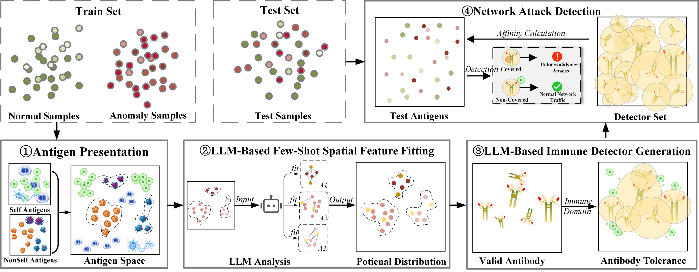
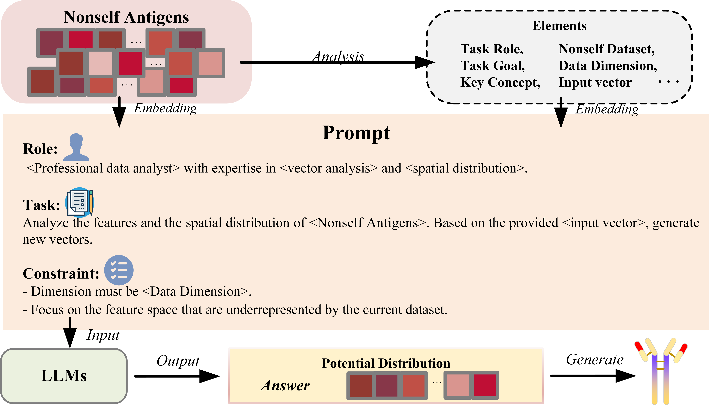
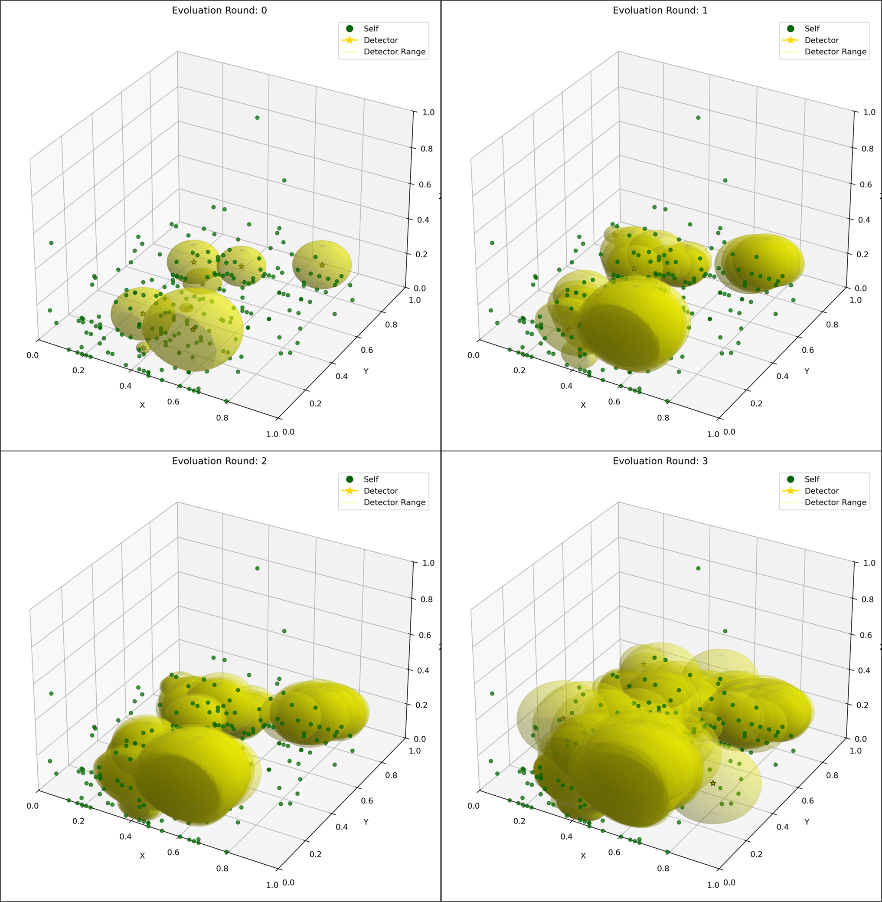

The rapidly evolving landscape of unknown network attacks has significantly expanded the range of cyber threats. However, existing intrusion detection systems (IDS) primarily rely on large amounts of known attack samples for model training and can only effectively detect known network attacks, particularly in industrial control system (ICS) environments, where obtaining attack samples is extremely difficult.In this paper, inspired by artificial immune systems (AIS) and large language models (LLM),we propose an LLM-basedimmune detection method for identifying unknown network attacks in ICS under few-shot conditions. The artificial immune system, as a biologically inspired intelligent algorithm, inherently possesses the ability to identify unknown threats. Meanwhile, LLM, with its strong reasoning ability, can deeply explore the latent spatial feature information even with limited train samples. Specifically, we first map network attack data to the antigen space of the artificial immune system. Then, we design a specialized prompt template to guide the LLM in learning and analyzing the spatial distribution features of nonself antigens, thereby capturing the latent space feature distribution information. Finally, we generate immune space detectors under the guidance of LLM and activate them through tolerance mechanisms. Extensive experiments on multiple datasets demonstrate that our method exhibits superior performance in detecting both known and unknown cyberattacks, significantly outperforming current mainstream IDS research achievements.

